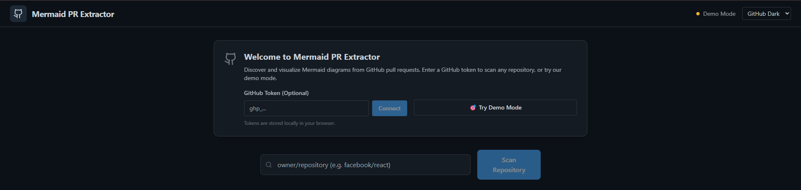
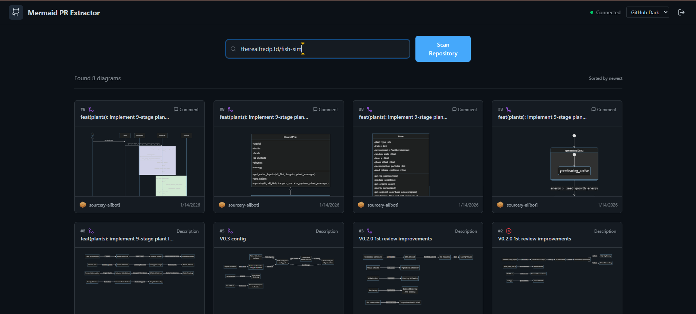

# Mermaid PR Extractor

A web application that extracts Mermaid diagrams from GitHub pull requests, allowing you to discover and visualize diagrams shared across your repository's PR history.

## Features

- 🔍 **Scan Repositories** - Search through recent pull requests for Mermaid diagrams
- 🎨 **Multiple Themes** - GitHub Dark/Light, Monokai, Dracula themes
- 📱 **Responsive Design** - Works on desktop and mobile devices
- 💾 **Export Options** - Download diagrams as Markdown or Draw.io XML
- 🔐 **Optional Authentication** - Try demo mode without a GitHub token
- ⚡ **Real-time Updates** - Live progress tracking during repository scans

## Prerequisites

- Node.js 18+
- GitHub Personal Access Token with `repo` scope (optional - demo mode available)

## Setup

1. **Install dependencies:**

   ```bash
   npm install
   ```

2. **Run the development server:**

   ```bash
   npm run dev
   ```

3. **Open your browser** to `http://localhost:3000` (or the port shown in terminal)



4. **Choose your experience:**
   - **Demo Mode**: Click "Try Demo Mode" to see sample diagrams immediately
   - **Full Mode**: Enter a GitHub token to scan any repository

## Usage

### Demo Mode (No Token Required)
1. Click "Try Demo Mode" on the welcome screen
2. View sample Mermaid diagrams to understand the app's capabilities
3. Explore the interface and export features

### Full Mode (GitHub Token Required)
1. **Create a GitHub Personal Access Token:**
   - Go to GitHub Settings → Developer settings → Personal access tokens → Tokens (classic)
   - Generate new token with `repo` scope
   - Copy the token (starts with `ghp_`)

2. **Authenticate** by entering your token and clicking "Connect"

3. **Scan repositories:**
   - Enter a repository in `owner/repository` format (e.g., `facebook/react`)
   - Click "Scan Repository" to search for Mermaid diagrams
   - Browse results and click on any diagram to view it in detail
   - Export diagrams using the download buttons in the modal

  

  

## Project Structure

```text
├── components/          # React components
│   ├── DiagramCard.tsx     # Diagram preview card
│   ├── DiagramModal.tsx    # Full diagram viewer
│   └── MermaidRenderer.tsx # Mermaid rendering component
├── services/           # API services
│   └── githubService.ts    # GitHub API client
├── utils/             # Utility functions
│   └── parsers.ts         # Diagram extraction logic
├── types.ts           # TypeScript type definitions
├── App.tsx            # Main application component
└── index.tsx          # Application entry point
```

## Security

- **Tokens are stored locally** in your browser's localStorage
- **No server-side storage** of credentials
- **Direct GitHub API communication** from your browser
- **Read-only access** to repository data

## Development

```bash
# Development server
npm run dev

# Build for production
npm run build

# Preview production build
npm run preview
```

## Technologies Used

- **React 19** - UI framework
- **TypeScript** - Type safety
- **Vite** - Build tool and dev server
- **Tailwind CSS** - Styling
- **Lucide React** - Icons
- **Mermaid.js** - Diagram rendering

## Contributing

1. Fork the repository
2. Create a feature branch
3. Make your changes
4. Add tests if applicable
5. Submit a pull request

## License

MIT License - see LICENSE file for details

## Support

If you encounter any issues:

1. Check your GitHub token has the correct permissions
2. Ensure the repository is public or you have access to private repos
3. Verify your internet connection
4. Check the browser console for error messages
