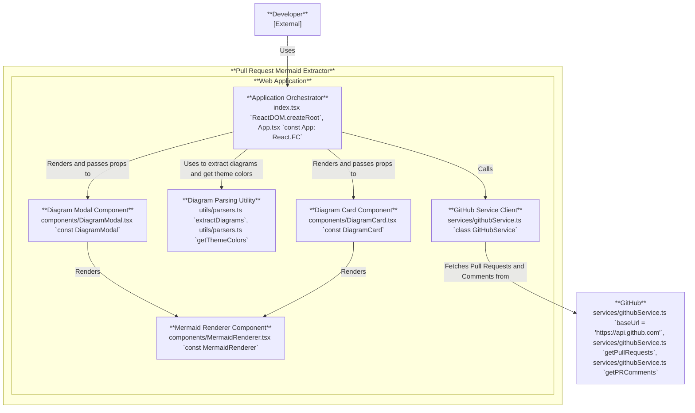

# Unnamed CodeViz Diagram

```mermaid
graph TD

    base.cv::developer["**Developer**<br>[External]"]
    base.cv::github["**GitHub**<br>services/githubService.ts `baseUrl = 'https://api.github.com'`, services/githubService.ts `getPullRequests`, services/githubService.ts `getPRComments`"]
    subgraph base.cv::pullRequestMermaidExtractor["**Pull Request Mermaid Extractor**<br>[External]"]
        subgraph base.cv::pullRequestMermaidExtractor_webapp["**Web Application**<br>[External]"]
            base.cv::pullRequestMermaidExtractor_webapp_app["**Application Orchestrator**<br>index.tsx `ReactDOM.createRoot`, App.tsx `const App: React.FC`"]
            base.cv::pullRequestMermaidExtractor_webapp_github_service["**GitHub Service Client**<br>services/githubService.ts `class GitHubService`"]
            base.cv::pullRequestMermaidExtractor_webapp_parser["**Diagram Parsing Utility**<br>utils/parsers.ts `extractDiagrams`, utils/parsers.ts `getThemeColors`"]
            base.cv::pullRequestMermaidExtractor_webapp_diagram_card["**Diagram Card Component**<br>components/DiagramCard.tsx `const DiagramCard`"]
            base.cv::pullRequestMermaidExtractor_webapp_diagram_modal["**Diagram Modal Component**<br>components/DiagramModal.tsx `const DiagramModal`"]
            base.cv::pullRequestMermaidExtractor_webapp_mermaid_renderer["**Mermaid Renderer Component**<br>components/MermaidRenderer.tsx `const MermaidRenderer`"]
            %% Edges at this level (grouped by source)
            base.cv::pullRequestMermaidExtractor_webapp_app["**Application Orchestrator**<br>index.tsx `ReactDOM.createRoot`, App.tsx `const App: React.FC`"] -->|"Calls"| base.cv::pullRequestMermaidExtractor_webapp_github_service["**GitHub Service Client**<br>services/githubService.ts `class GitHubService`"]
            base.cv::pullRequestMermaidExtractor_webapp_app["**Application Orchestrator**<br>index.tsx `ReactDOM.createRoot`, App.tsx `const App: React.FC`"] -->|"Uses to extract diagrams and get theme colors"| base.cv::pullRequestMermaidExtractor_webapp_parser["**Diagram Parsing Utility**<br>utils/parsers.ts `extractDiagrams`, utils/parsers.ts `getThemeColors`"]
            base.cv::pullRequestMermaidExtractor_webapp_app["**Application Orchestrator**<br>index.tsx `ReactDOM.createRoot`, App.tsx `const App: React.FC`"] -->|"Renders and passes props to"| base.cv::pullRequestMermaidExtractor_webapp_diagram_card["**Diagram Card Component**<br>components/DiagramCard.tsx `const DiagramCard`"]
            base.cv::pullRequestMermaidExtractor_webapp_app["**Application Orchestrator**<br>index.tsx `ReactDOM.createRoot`, App.tsx `const App: React.FC`"] -->|"Renders and passes props to"| base.cv::pullRequestMermaidExtractor_webapp_diagram_modal["**Diagram Modal Component**<br>components/DiagramModal.tsx `const DiagramModal`"]
            base.cv::pullRequestMermaidExtractor_webapp_diagram_modal["**Diagram Modal Component**<br>components/DiagramModal.tsx `const DiagramModal`"] -->|"Renders"| base.cv::pullRequestMermaidExtractor_webapp_mermaid_renderer["**Mermaid Renderer Component**<br>components/MermaidRenderer.tsx `const MermaidRenderer`"]
            base.cv::pullRequestMermaidExtractor_webapp_diagram_card["**Diagram Card Component**<br>components/DiagramCard.tsx `const DiagramCard`"] -->|"Renders"| base.cv::pullRequestMermaidExtractor_webapp_mermaid_renderer["**Mermaid Renderer Component**<br>components/MermaidRenderer.tsx `const MermaidRenderer`"]
        end
    end
    %% Edges at this level (grouped by source)
    base.cv::developer["**Developer**<br>[External]"] -->|"Uses"| base.cv::pullRequestMermaidExtractor_webapp_app["**Application Orchestrator**<br>index.tsx `ReactDOM.createRoot`, App.tsx `const App: React.FC`"]
    base.cv::pullRequestMermaidExtractor_webapp_github_service["**GitHub Service Client**<br>services/githubService.ts `class GitHubService`"] -->|"Fetches Pull Requests and Comments from"| base.cv::github["**GitHub**<br>services/githubService.ts `baseUrl = 'https://api.github.com'`, services/githubService.ts `getPullRequests`, services/githubService.ts `getPRComments`"]

```
---
*Generated by [CodeViz.ai](https://codeviz.ai) on 1/16/2026, 3:03:38 AM*
